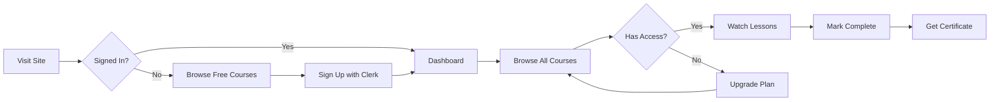
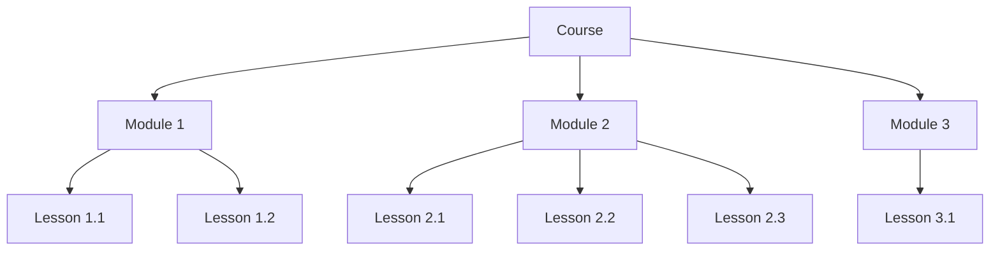
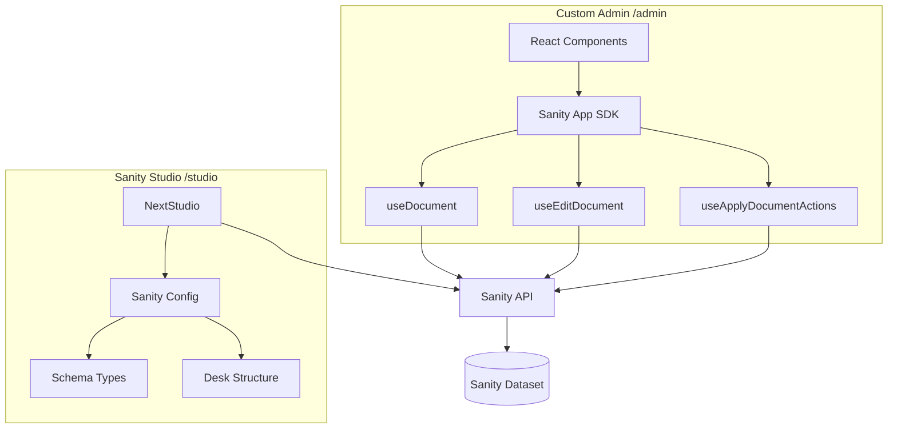
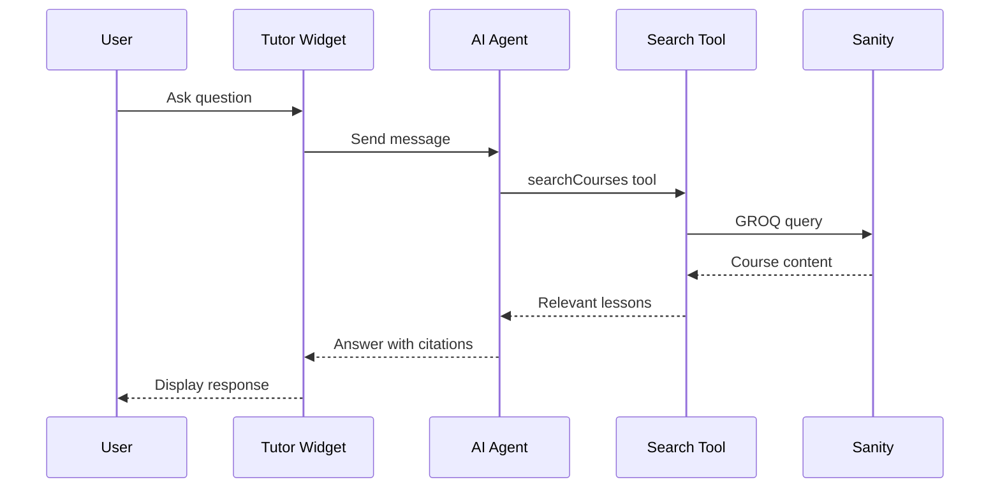

# Sonny's Academy - AI-Powered LMS Platform

[](https://creativecommons.org/licenses/by-nc/4.0/)
[](https://nextjs.org/)
[](https://react.dev/)
[](https://www.sanity.io/)
[](https://clerk.com/)
[](https://www.mux.com/)
[](https://openai.com/)
[](https://tailwindcss.com/)

> **Learn to build production-ready LMS platforms** with modern architecture, AI-powered features, and bespoke CMS solutions.

---

<table>
<tr>
<td width="33%">

### 🎯 Who This Is For

Developers who want to learn how to build **real-world course platforms** from scratch. Perfect for:
- Aspiring full-stack developers
- Developers exploring headless CMS
- Anyone building SaaS products

</td>
<td width="33%">

### ✨ What Makes This Special

- **Custom Admin Panel** built with Sanity App SDK (not just Studio!)
- **AI Learning Assistant** powered by GPT-4o
- **Tiered Subscriptions** with Clerk billing
- **Professional  Sonny's Academy - AI-Powered LMS Platform

[](https://creativecommons.org/licenses/by-nc/4.0/)
[](https://nextjs.org/)
[](https://react.dev/)
[](https://www.sanity.io/)
[](https://clerk.com/)
[](https://www.mux.com/)
[](https://openai.com/)
[](https://tailwindcss.com/)

> **Learn to build production-ready LMS platforms** with modern architecture, AI-powered features, and bespoke CMS solutions.

---

<table>
<tr>
<td width="33%">

### 🎯 Who This Is For

Developers who waVideo Streaming** via Mux

</td>
<td width="33%">

### 🛠️ Technical Highlights

- Next.js 16 App Router + React 19
- Real-time content updates with Sanity SDK
- Drag-and-drop course builder
- TypeScript end-to-end with typegen
- Modern UI with Shadcn + Tailwind 4

</td>
</tr>
</table>

---

## 👇🏼 DO THIS Before You Get Started

Before diving into the code, set up accounts with these services:

### 🎁 USE THESE Links!

> **⚠️ IMPORTANT:** Using these affiliate links helps keep this content FREE for everyone! Your support makes a huge difference.

<table>
<tr>
<th>Service</th>
<th>What It's For</th>
<th>Get Started</th>
</tr>
<tr>
<td><strong>🟢 Sanity</strong></td>
<td>Headless CMS for all your content</td>
<td><a href="https://www.sanity.io/sonny?utm_source=youtube&utm_medium=video&utm_content=ai-lms-platform"><strong>👉 Get Started with Sanity</strong></a></td>
</tr>
<tr>
<td><strong>🔐 Clerk</strong></td>
<td>Authentication & subscription billing</td>
<td><a href="https://go.clerk.com/5fXjeWr"><strong>👉 Get Started with Clerk</strong></a></td>
</tr>
<tr>
<td><strong>🤖 CodeRabbit</strong></td>
<td>AI-powered code reviews</td>
<td><a href="https://coderabbit.link/sonny-dec"><strong>👉 Get Started with CodeRabbit</strong></a></td>
</tr>
</table>

**💡 Pro Tip:** These are the exact services used in production - you'll need them to follow along!

### Other Required Services

| Service | What It's For | Get Started |
|---------|---------------|-------------|
| **Mux** | Video hosting & streaming | 👉 [mux.com](https://www.mux.com/) |
| **OpenAI** | AI tutor functionality | 👉 [platform.openai.com](https://platform.openai.com/) |

---

## 📖 What Is This App?

**Think of Sonny's Academy as Netflix for courses, but with an AI tutor that knows everything about your content.**

This is a Learning Management System (LMS) - a platform where:
- **Creators** upload and organize video courses
- **Learners** watch lessons, track progress, and get AI-powered help
- **Admins** manage everything through a beautiful custom dashboard

### Key Concepts

| Concept | What It Means |
|---------|---------------|
| **Course** | A collection of modules on a topic (e.g., "Master React") |
| **Module** | A chapter within a course (e.g., "React Hooks Deep Dive") |
| **Lesson** | An individual video + notes (e.g., "Understanding useState") |
| **Tier** | Access level: Free, Pro ($), or Ultra ($$) |
| **AI Tutor** | Chat assistant that searches your course content to answer questions |

### Example Use Cases

- 🎓 **Online Course Platform** - Sell programming courses with subscription tiers
- 🏢 **Corporate Training** - Internal training portal for employees
- 📚 **Educational Institution** - Supplement classroom learning with video content

---

## 🚀 Before We Dive In - Join the PAPAFAM!

**Want to build apps like this from scratch?** Join thousands of developers leveling up their skills!

### What You'll Master

- ⚛️ Modern React patterns & Next.js App Router
- 🗄️ Headless CMS architecture with Sanity
- 🔐 Production authentication & billing flows
- 🤖 AI integration with tool calling & RAG patterns
- 📹 Professional video streaming infrastructure
- 🎨 Beautiful UI with Tailwind CSS & Shadcn

### PAPAFAM Community Benefits

- 📺 **Full Build Videos** - Watch every line of code being written
- 💬 **Discord Community** - Get help from Sonny and 50,000+ developers
- 🏆 **Project Portfolio** - Ship real projects, not toy apps
- 🎯 **Career Guidance** - From beginner to job-ready

### Real Results

> "I went from tutorial hell to shipping production apps in 3 months" - PAPAFAM Graduate

### What's Included

- Step-by-step video tutorials
- Complete source code access
- Private Discord channels
- Weekly live coding sessions
- Resume & portfolio reviews

👉 **[Join the PAPAFAM Today](https://www.papareact.com/course)**

---

## ⭐ Features

### For Learners

| Feature | Free | Pro | Ultra |
|---------|:----:|:---:|:-----:|
| Access to foundational courses | ✅ | ✅ | ✅ |
| Community Discord access | ✅ | ✅ | ✅ |
| Basic projects & exercises | ✅ | ✅ | ✅ |
| Email support | ✅ | ✅ | ✅ |
| All Pro-tier courses | ❌ | ✅ | ✅ |
| Advanced real-world projects | ❌ | ✅ | ✅ |
| Priority support | ❌ | ✅ | ✅ |
| Course completion certificates | ❌ | ✅ | ✅ |
| **🤖 AI Learning Assistant** | ❌ | ❌ | ✅ |
| Exclusive Ultra-only content | ❌ | ❌ | ✅ |
| Monthly 1-on-1 sessions | ❌ | ❌ | ✅ |
| Private Discord channel | ❌ | ❌ | ✅ |
| Early access to new courses | ❌ | ❌ | ✅ |
| Lifetime updates | ❌ | ❌ | ✅ |

### For Developers (Technical Features)

#### 🏗️ The `/admin` vs `/studio` Paradigm

This project teaches you **two different approaches** to content management:

| Route | Technology | Purpose |
|-------|------------|---------|
| `/admin` | **Sanity App SDK** | Custom bespoke CMS frontend - Build your own admin experience |
| `/studio` | **Sanity Studio** | Traditional Sanity Studio - Full CMS fallback |

**Why both?** The `/admin` route demonstrates how to build a completely custom content management experience using Sanity's App SDK. This is the modern way to create bespoke backends tailored to your exact needs. The `/studio` route serves as a fallback for advanced CMS operations.

#### Sanity App SDK Features Used

```typescript
// Hooks for real-time document editing
import {
  useDocument,        // Read document/field data
  useEditDocument,    // Edit document fields
  useDocuments,       // List all documents of a type
  useQuery,           // Run GROQ queries
  useApplyDocumentActions,  // Apply document mutations
} from "@sanity/sdk-react";

// Document actions
import {
  publishDocument,
  unpublishDocument,
  discardDocument,
  deleteDocument,
  createDocument,
} from "@sanity/sdk-react";
```

#### Custom Admin Components

- 📝 **CourseEditor** - Full course editing with modules sidebar
- 🎯 **ModuleAccordionInput** - Drag-and-drop module reordering
- 🖼️ **ImageInput** - Image upload with preview
- 🔗 **ReferenceInput** - Document reference picker
- 🏷️ **SlugInput** - Auto-generated URL slugs
- ⚡ **DocumentActions** - Publish/Unpublish/Discard/Delete

#### 🤖 AI Learning Assistant

- Powered by **GPT-4o** via Vercel AI SDK
- **Tool calling** to search course content
- Semantic search across courses, modules, and lessons
- Only available to Ultra subscribers

#### 📹 Video Streaming

- **Mux** integration for professional video hosting
- Signed playback tokens for security
- Adaptive bitrate streaming
- Thumbnail and storyboard generation

#### 🔐 Authentication & Billing

- **Clerk** handles auth, users, and subscriptions
- Pricing table component for plan selection
- Tier-based content gating
- Webhook integration for billing events

#### 📊 Progress Tracking

- Mark lessons as complete
- Track course completion percentage
- Per-user progress stored in Sanity

---

## 🔄 How It Works

### User Journey



### Content Hierarchy



### Admin vs Studio Architecture



### AI Tutor Flow



---

## 🚀 Getting Started

### Prerequisites

- **Node.js 18+** (recommend using [nvm](https://github.com/nvm-sh/nvm))
- **pnpm** (package manager)
- Accounts: Sanity, Clerk, Mux, OpenAI

### Installation

1. **Clone the repository**

```bash
git clone https://github.com/your-username/sonnys-academy.git
cd sonnys-academy
```

2. **Install dependencies**

```bash
pnpm install
```

3. **Copy environment variables**

```bash
cp .env.example .env.local
```

4. **Configure environment variables** (see below)

5. **Run development server**

```bash
pnpm dev
```

6. **Open the app**

- Main app: [http://localhost:3000](http://localhost:3000)
- Admin panel: [http://localhost:3000/admin](http://localhost:3000/admin)
- Sanity Studio: [http://localhost:3000/studio](http://localhost:3000/studio)

### Environment Variables

Create a `.env.local` file with the following variables:

```bash
# Sanity Configuration
NEXT_PUBLIC_SANITY_PROJECT_ID=your_project_id
NEXT_PUBLIC_SANITY_DATASET=production
NEXT_PUBLIC_SANITY_API_VERSION=2025-11-27

# Clerk Authentication
NEXT_PUBLIC_CLERK_PUBLISHABLE_KEY=pk_test_...
CLERK_SECRET_KEY=sk_test_...

# OpenAI (for AI Tutor)
OPENAI_API_KEY=sk-...

# Mux Video
MUX_TOKEN_ID=your_mux_token_id
MUX_TOKEN_SECRET=your_mux_token_secret
MUX_SIGNING_KEY_ID=your_signing_key_id
MUX_SIGNING_KEY_PRIVATE=your_signing_key_private
```

> ⚠️ **Security Notes:**
> - Never commit `.env.local` to version control
> - Variables starting with `NEXT_PUBLIC_` are exposed to the browser
> - Keep `CLERK_SECRET_KEY` and `MUX_SIGNING_KEY_PRIVATE` strictly server-side

### First-Time Setup Checklist

- [ ] Create Sanity project and get credentials
- [ ] Set up Clerk application with pricing plans (Free, Pro, Ultra)
- [ ] Configure Clerk webhooks for billing events
- [ ] Create Mux account and get API tokens
- [ ] Generate Mux signing keys for secure playback
- [ ] Add OpenAI API key
- [ ] Run `pnpm dev` and verify all pages load
- [ ] Create your first course via `/admin` or `/studio`

---

## 🗄️ Database Schema Overview

### Document Types

| Type | Description | Key Fields |
|------|-------------|------------|
| **Course** | Top-level learning container | title, slug, description, tier, modules[], featured |
| **Module** | Groups related lessons | title, description, lessons[] |
| **Lesson** | Individual learning unit | title, slug, description, video, content, completedBy[] |
| **Category** | Organizes courses | title, description |
| **Note** | User notes (demo feature) | title, content, status |

### Relationships

```
Course
├── category (reference → Category)
├── modules[] (references → Module[])
│   └── lessons[] (references → Lesson[])
└── completedBy[] (user IDs who completed)

Lesson
├── video (Mux video asset)
├── content (Portable Text)
└── completedBy[] (user IDs who completed)
```

### Design Decisions

1. **References over embedding** - Modules and lessons are separate documents referenced by courses. This allows reusing content across courses.

2. **Completion tracking in documents** - User completion is stored as arrays of user IDs directly on course/lesson documents for simplicity.

3. **Tier on courses, not lessons** - Access control is at the course level. All lessons in a course inherit its tier.

4. **Portable Text for lesson content** - Rich text with full formatting support for lesson notes.

---

## 🚢 Deployment

### Deploy to Vercel

#### Option 1: Vercel CLI

```bash
# Install Vercel CLI
pnpm i -g vercel

# Deploy
vercel

# For production
vercel --prod
```

#### Option 2: GitHub Integration

1. Push your code to GitHub
2. Go to [vercel.com](https://vercel.com)
3. Import your repository
4. Add environment variables
5. Deploy!

### Post-Deployment Checklist

- [ ] Verify all environment variables are set in Vercel
- [ ] Test authentication flow (sign up, sign in, sign out)
- [ ] Test subscription purchase flow
- [ ] Verify video playback works
- [ ] Test AI tutor (Ultra accounts only)
- [ ] Set up Clerk webhooks with production URL
- [ ] Configure Sanity CORS for production domain

### Configure Clerk Webhooks

1. Go to Clerk Dashboard → Webhooks
2. Add endpoint: `https://your-domain.com/api/webhooks/clerk`
3. Select events: `user.created`, `user.updated`, `subscription.created`, `subscription.updated`

---

## 🔧 Common Issues & Solutions

### Authentication Issues

| Problem | Solution |
|---------|----------|
| "Clerk not loading" | Check `NEXT_PUBLIC_CLERK_PUBLISHABLE_KEY` is set correctly |
| "Unauthorized" errors | Verify `CLERK_SECRET_KEY` matches your Clerk app |
| Subscription not recognized | Check Clerk webhook is configured and receiving events |

### Video Issues

| Problem | Solution |
|---------|----------|
| Videos not playing | Verify Mux credentials are correct |
| "Playback token invalid" | Check `MUX_SIGNING_KEY_PRIVATE` is properly formatted |
| Videos stuck loading | Ensure Mux asset status is "ready" in Sanity |

### Sanity Issues

| Problem | Solution |
|---------|----------|
| "Project not found" | Double-check `NEXT_PUBLIC_SANITY_PROJECT_ID` |
| Content not updating | Check you're using the correct dataset |
| TypeScript errors | Run `pnpm typegen` to regenerate types |
| Schema changes not appearing | Restart dev server and rebuild Studio |

### AI Tutor Issues

| Problem | Solution |
|---------|----------|
| Tutor not responding | Verify `OPENAI_API_KEY` is valid |
| "No content found" | Ensure courses have published content |
| Tutor showing for non-Ultra users | Check Clerk subscription configuration |

---

## 🏆 Take It Further - Challenge Time!

Ready to level up? Here are advanced features to build:

### Learning Features

- [ ] **Quizzes** - Add quiz questions after each lesson
- [ ] **Certificates** - Generate PDF certificates on course completion
- [ ] **Discussion forums** - Comment sections for each lesson
- [ ] **Bookmarks** - Save favorite lessons for later

### AI Improvements

- [ ] **Multiple AI models** - Add Claude, Gemini support
- [ ] **Chat history** - Persist tutor conversations
- [ ] **Contextual help** - Auto-suggest based on current lesson
- [ ] **Content generation** - AI-assisted lesson writing

### Infrastructure & Scaling

- [ ] **Search** - Full-text search with Algolia or Typesense
- [ ] **Analytics** - Track engagement with Posthog or Plausible
- [ ] **Email notifications** - Course updates, completion emails
- [ ] **Multi-tenancy** - White-label for organizations

### Monetization

- [ ] **One-time purchases** - Buy individual courses
- [ ] **Gift subscriptions** - Purchase for others
- [ ] **Affiliate program** - Referral commissions
- [ ] **Team plans** - B2B licensing

---

## 📄 License

This project is licensed under the **Creative Commons Attribution-NonCommercial 4.0 International License**.

### You CAN:

- ✅ Use this code for learning and personal projects
- ✅ Modify and adapt the code
- ✅ Share your modifications (with attribution)
- ✅ Use as a portfolio piece

### You CANNOT:

- ❌ Use this code for commercial purposes
- ❌ Sell courses or templates based on this code
- ❌ Remove attribution to the original author
- ❌ Use for client work without a commercial license

### Need Commercial Use?

Contact [Sonny Sangha](https://www.papareact.com) for commercial licensing options.

See [LICENSE.md](LICENSE.md) for the full license text.

---

## 📚 Quick Reference

### Useful Commands

```bash
# Development
pnpm dev              # Start dev server
pnpm build            # Production build
pnpm start            # Start production server

# Type Generation
pnpm typegen          # Generate Sanity types
pnpm typecheck        # Check TypeScript

# Code Quality
pnpm lint             # Run Biome linter
pnpm format           # Format with Biome
```

### Key Files & Folders

```
├── app/
│   ├── (admin)/admin/     # Custom admin panel (Sanity App SDK)
│   ├── (app)/             # Main learner-facing app
│   ├── studio/            # Sanity Studio
│   └── api/               # API routes (AI chat)
├── components/
│   ├── admin/             # Admin components & editors
│   ├── courses/           # Course display components
│   ├── lessons/           # Lesson player & sidebar
│   ├── tutor/             # AI tutor widget
│   └── ui/                # Shadcn components
├── lib/
│   ├── actions/           # Server actions
│   ├── ai/                # AI agent & tools
│   └── hooks/             # Custom React hooks
├── sanity/
│   ├── schemaTypes/       # Sanity schema definitions
│   └── lib/               # Sanity client & queries
└── sanity.config.ts       # Sanity Studio config
```

### Important Concepts

| Concept | File(s) | Description |
|---------|---------|-------------|
| Sanity App SDK Provider | `components/SanityAppProvider.tsx` | Wraps app with Sanity SDK context |
| Tier Access Control | `lib/course-access.ts` | Checks user subscription tier |
| AI Tutor Agent | `lib/ai/tutor-agent.ts` | GPT-4o agent with course search tool |
| Document Actions | `components/admin/documents/DocumentActions.tsx` | Publish/unpublish/delete logic |
| Tier Features | `lib/constants.ts` | Feature list per subscription tier |

---

<p align="center">
  <strong>Built with ❤️ by <a href="https://www.papareact.com">Sonny Sangha</a></strong>
  <br />
  <a href="https://www.papareact.com/course">Join the PAPAFAM</a> •
  <a href="https://www.youtube.com/@SonnySangha">YouTube</a> •
  <a href="https://twitter.com/SonnySangha">Twitter</a>
</p>
